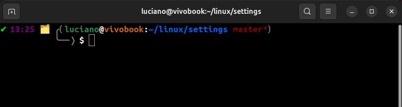

# Dev Machine Setup

**Purpose**
This repository collects the basic settings and configuration files to apply when start working on a new Ubuntu machine. It contains detailed instructions for applying the settings and useful settings files.

---

## Repository structure

- `.bashrc` — my custom `~/.bashrc` file (copy to `~/.bashrc` and `source` it).
- `.gitignore` — files to ignore for this repository.
- `LICENSE` — MIT license for the repository.
- `README.md` — this file (instructions & checklist).
- `settings.json` — VS Code user settings (path: `~/.config/Code/User/settings.json`).

---

## Table of contents

1. [Customize bashrc / terminal](#customize-bashrc--terminal)

   1.a. Set a custom `.bashrc` file

   1.b. Change GNOME Terminal preferences

2. [Git settings](#git-settings)

   2.a. Global configuration

   2.b. Local configuration

   2.c. Show git settings

3. [SSH keys](#ssh-keys)

   3.a. Generate key pair

   3.b. Copy public key to a remote machine

   3.c. Add public key to GitHub / GitLab / Bitbucket

4. [VS Code](#vs-code)

   4.a. Recommended extensions

   4.b. Apply local settings (settings.json)

   4.c. Apply settings on a remote machine (Remote - SSH)

5. [Quick start checklist](#quick-start-checklist)

6. [Notes & tips](#notes--tips)

---

## Customize bashrc / terminal

### 1.a Set a custom `~/.bashrc` file

Things included in the custom `.bashrc`:

- Set a custom `PS1` prompt with colors, relevant info, and custom separators:
```bash
 Format: ✔/✘ HH:MM 🗂️ ╭⟮[env] user@host:directory [branch/hash][*]⟯
                      ╰──❭ $/# 
Example:   ✔ 10:43 🗂️ ╭⟮luciano@vivobook:~/project master⟯
                      ╰──❭ $ 
```
- Increase shell history:
- Color GCC warnings/errors (two options):
- Alias `python` to `python3`:

Steps:

1. Make a backup of your current version first:
```bash
cp ~/.bashrc ~/.bashrc.backup
```

2. Copy the file from this repository into your home directory:
```bash
# From your home or any working directory
git clone https://github.com/luchocurti/dev-machine-setup.git
cd ~/dev-machine-setup
cp .bashrc ~/.bashrc
# Apply changes immediately
source ~/.bashrc
```

### 1.b Change GNOME Terminal preferences
1. Open GNOME Terminal.
2. Menu → **Preferences**.
3. Select the profile (e.g., *Unnamed*).
4. Appearance / Colors → choose a built-in scheme such as **Gray on black** or a dark profile.
5. Optionally: uncheck “Use colors from system theme” and set custom text/background colors.

### Terminal preview



---

## Git settings

### 2.a Set git global configuration (machine-level)
Run these commands to set your global git configuration:
```bash
git config --global user.name "Name Surname"
git config --global user.email "user@email.com"
git config --global diff.tool meld
git config --global merge.tool meld
git config --global mergetool.prompt true
git config --global mergetool.keepBackup true
git config --global core.editor "code --wait"
git config --global core.autocrlf input
git config --global credential.helper "cache --timeout=3600"
git config --global color.ui auto
git config --global difftool.prompt true
git config --global init.defaultBranch master
```

### 2.b Set git local configuration (per-repository @ remote machines)
Inside a repository run:
```bash
git config --local user.name "Name Surname"
git config --local user.email "user@email.com"
```

### 2.c Show git settings
To inspect different levels of configuration:
```bash
echo "All git settings"
git config --list --show-origin

echo "Global settings"
git config --global --list

echo "Local settings (run inside a Git repository)"
git config --local --list

echo "System settings"
git config --system --list
```

---

## SSH keys

### 3.a Generate a key pair
Prefer ED25519 keys (modern and compact):
```bash
ssh-keygen -t ed25519 -C "your@email.com"
# follow prompts, accept default file location (~/.ssh/id_ed25519)
```

### 3.b Copy public key to a remote machine
Use `ssh-copy-id` to append your public key to `~/.ssh/authorized_keys` on the remote host:
```bash
ssh-copy-id -i ~/.ssh/id_ed25519.pub user@remote_machine
# then test
ssh user@remote_machine
```

If `ssh-copy-id` is not available, copy the contents of `~/.ssh/id_ed25519.pub` and append to `~/.ssh/authorized_keys` on the remote host (set correct permissions: `chmod 700 ~/.ssh` and `chmod 600 ~/.ssh/authorized_keys`).

### 3.c Add public key to GitHub / GitLab / Bitbucket
1. Copy the contents of your public key:
```bash
cat ~/.ssh/id_ed25519.pub
# copy the printed line
```
2. On Git hosting service:
- **GitHub:** Settings → SSH and GPG keys → New SSH key → paste key → Save
- **GitLab:** User Settings → SSH Keys → Add key → Save
- **Bitbucket:** Personal settings → SSH keys → Add key → Save

3. Test:
```bash
ssh -T git@github.com   # or git@gitlab.com, git@bitbucket.org
```

---

## VS Code

### 4.a Recommended extensions
Open the Extensions view (Ctrl + Shift + X) and install the extensions you need. Recommended categories:
- C/C++ language support (IntelliSense, debugging)
- C/C++ themes & icon packs
- CMake & CMake Tools
- Remote - SSH (for remote editing and development)
- Remote Explorer / Remote - SSH: Editing Configuration Files
- Material Icon Theme (optional)

You can also install from the command line:
```bash
code --install-extension <extension-id>
```
If you don't know the exact extension id, search by the extension name in the Extensions view.

### 4.b Apply local settings
1. Open VS Code → `Ctrl + Shift + P` → **Preferences: Open User Settings (JSON)**.
2. Edit `~/.config/Code/User/settings.json` (or the path used by your VS Code build) — this repository contains `settings.json` which you can copy there:
```bash
cp settings.json ~/.config/Code/User/settings.json
```
3. Restart VS Code

### 4.c Apply settings on a remote machine (Remote - SSH)
1. Connect to the remote host using **Remote - SSH** in the Remote Explorer.
2. While connected to the remote, `Ctrl + Shift + P` → **Preferences: Open Remote Settings (JSON)** (this will open the remote user settings file).
3. Copy relevant settings from your local `settings.json` into the remote settings file and save.
4. Restart the remote VS Code window.

> Tip: extensions can be installed on the remote host by selecting "Install on SSH: <host>" from each extension's menu.

---

## Quick start checklist (apply on a new Ubuntu machine)

1. Update OS & install base tools:
```bash
sudo apt update && sudo apt upgrade -y
sudo apt install git curl build-essential wget openssh-client
```
2. Clone this Dev Machine Setup repo:
```bash
git clone https://github.com/luchocurti/dev-machine-setup.git
cd ~/dev-machine-setup
```
3. Apply `.bashrc`:
```bash
cp ~/.bashrc ~/.bashrc.backup
cp .bashrc ~/.bashrc
source ~/.bashrc
```
4. Apply git global config (edit values first):
```bash
# copy the commands from this README into a script or run manually
```
5. Generate or copy SSH key:
```bash
# if you already have one, copy to the new machine ~/.ssh/
# otherwise generate:
ssh-keygen -t ed25519 -C "your@email.com"
```
6. Install VS Code (if not installed) and copy `settings.json`:
```bash
# copy settings.json
mkdir -p ~/.config/Code/User
cp settings.json ~/.config/Code/User/settings.json
```
7. Install recommended VS Code extensions using the Extensions view or `code --install-extension`.
8. Test SSH access to your servers and to Git hosting.

---

## Notes & tips
- Keep secrets out of your repository. Never commit private keys or credentials. Add `~/.ssh/*` to `.gitignore` if you ever push from a machine that contains your keys.
- Prefer ED25519 keys for SSH unless you have compatibility constraints.
- If you rely on the same dotfiles across many machines, consider a dotfiles manager (bare git repo in `~/.cfg`) — outside the scope of this README, but useful once the repo grows.
- Keep this README minimal and add short examples rather than long essays — it makes quick setup easier.

---

## License
This repository is released under the MIT License. See `LICENSE` for details.
